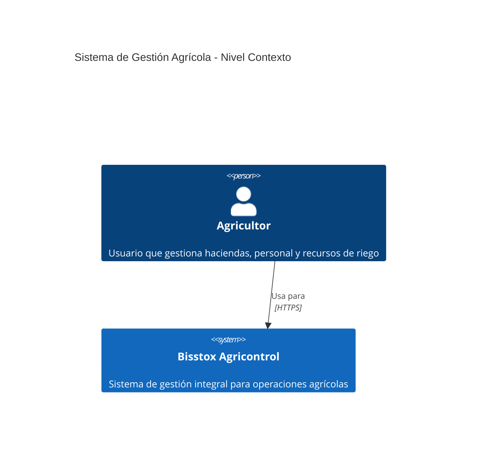
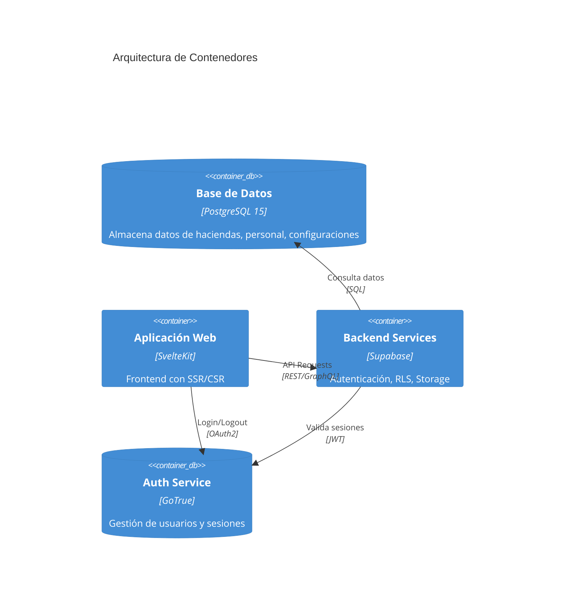
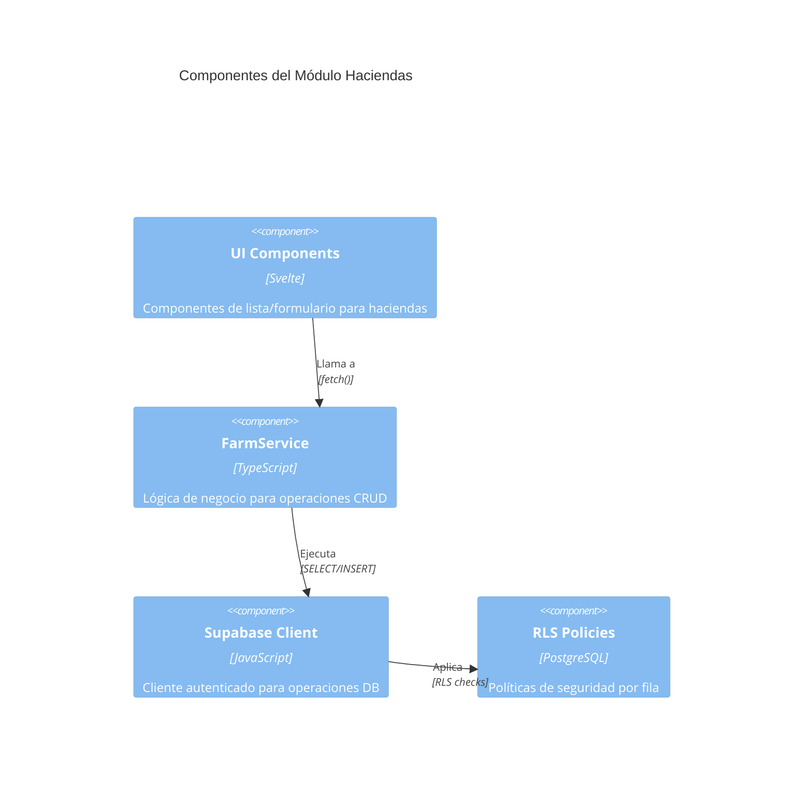
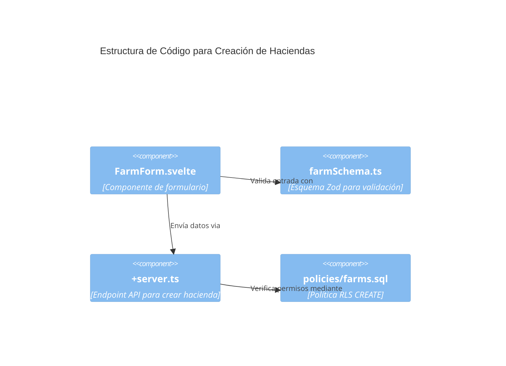
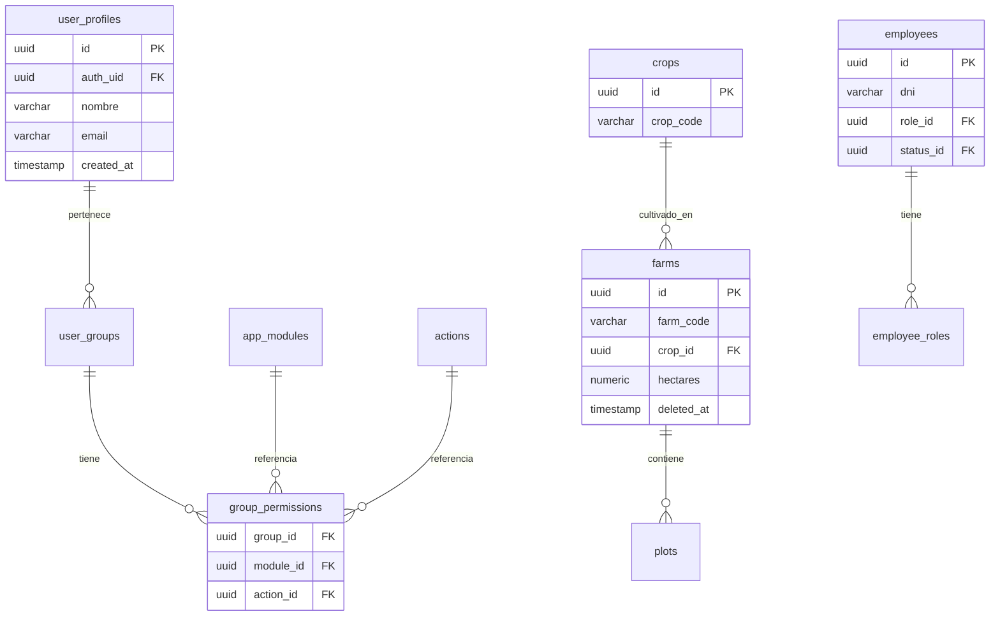
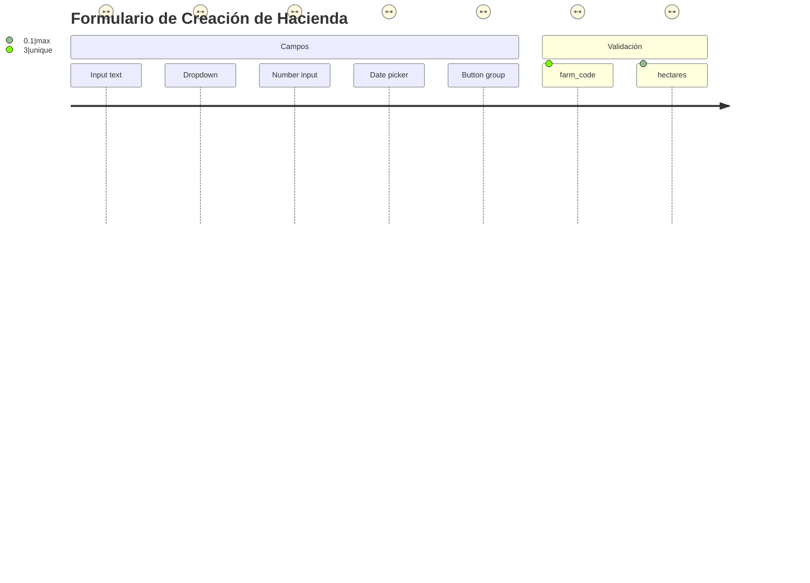
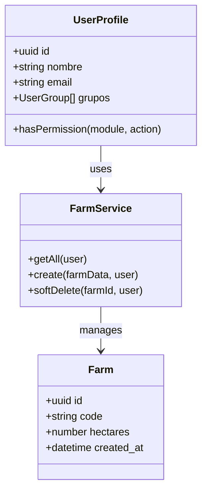
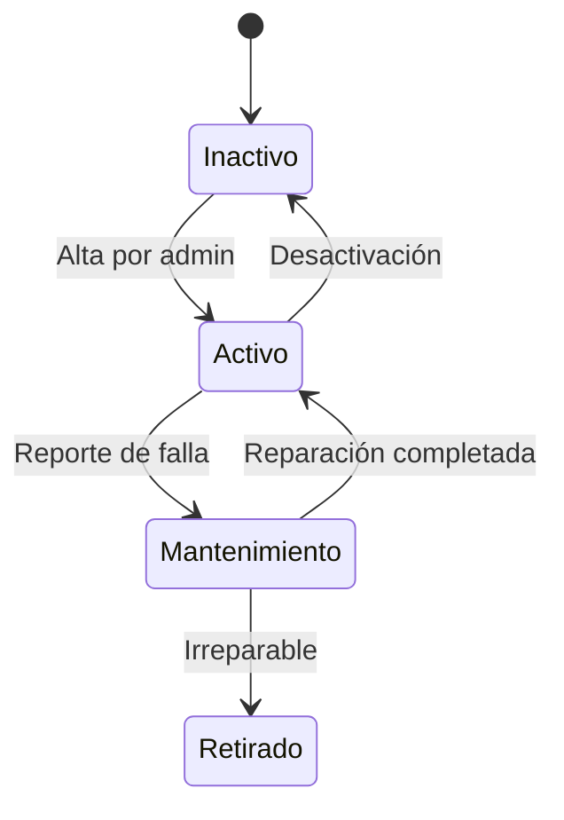
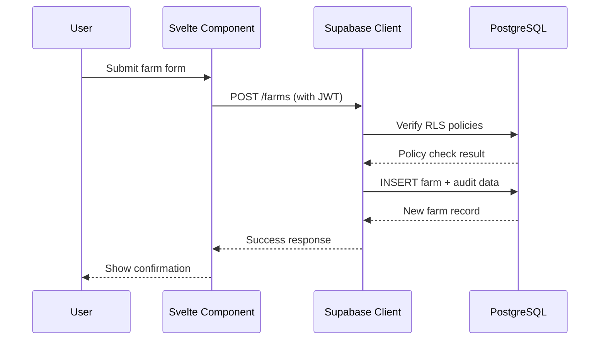

---
up:
  - "[[Crear versión SaaS de Bisstox Agricontrol]]"
related:
  - "[[Nueva arquitectura propuesta para Agricontrol]]"
created: 2025-05-19
---

 # Plan detallado para Bisstox Agricontrol

A continuación se presenta un plan fase por fase para construir la línea base de la aplicación **Bisstox Agricontrol** con el stack especificado, garantizando una arquitectura sólida y fácil de extensión. Se incluyen pasos concretos, recomendaciones técnicas y referencias a documentación oficial.

## Fase 1: Configuración inicial

- **Instalación de herramientas:** Instalar en la máquina de desarrollo (Ubuntu remoto y Windows 10 con VS Code Remote) Node.js/LTS, npm (o pnpm/yarn), y la CLI de Supabase. También instalar Docker (o Podman) en el host Ubuntu para el desarrollo local con Supabase[supabase.com](https://supabase.com/docs/guides/local-development/cli/getting-started#:~:text=supabase%20init). Por ejemplo, ejecutar `npm install -g supabase` y verificar `supabase --version`. Habilitar Docker en Ubuntu siguiendo la guía oficial[supabase.com](https://supabase.com/docs/guides/local-development/cli/getting-started#:~:text=The%20Supabase%20CLI%20uses%20Docker,install%20and%20configure%20Docker%20Desktop).
    
- **Inicializar proyecto Supabase:** Crear un nuevo proyecto Supabase local con `supabase init`. Esto genera una carpeta `supabase/` con la configuración inicial (conteniendo archivos de migraciones y datos de esquema)[supabase.com](https://supabase.com/docs/guides/local-development/cli/getting-started#:~:text=supabase%20init). Importante: **incluir esta carpeta en el control de versiones** para versionar el esquema de la base de datos. Luego ejecutar `supabase start` para levantar los servicios locales (Postgres, Auth, Storage, etc.)[supabase.com](https://supabase.com/docs/guides/local-development/cli/getting-started#:~:text=supabase%20start). Esto descargará los contenedores Docker necesarios y desplegará un stack local de Supabase.
    
- **Configuración de variables de entorno:** En la raíz del proyecto crear un archivo `.env.local` para las claves públicas de Supabase. Allí definir `PUBLIC_SUPABASE_URL` con la URL del proyecto Supabase (por ejemplo del local o de staging) y `PUBLIC_SUPABASE_ANON_KEY` con la llave pública anónima[supabase.com](https://supabase.com/docs/guides/auth/server-side/sveltekit#:~:text=Create%20a%20,your%20project%20root%20directory). Por ejemplo:
    
    ```
    env
    CopyEdit
    PUBLIC_SUPABASE_URL=https://<tu-supabase>.supabase.co
    PUBLIC_SUPABASE_ANON_KEY=<tu-llave-anon>
    
    ```
    
    Estas variables se usarán en el frontend SvelteKit para conectar con el backend. [supabase.com](https://supabase.com/docs/guides/auth/server-side/sveltekit#:~:text=Create%20a%20,your%20project%20root%20directory)
    
- **Proyecto SvelteKit:** Crear el proyecto frontend con SvelteKit (`pnpm create svelte@next`), seleccionando TypeScript y adaptador Node/estático según se requiera. Instalar el paquete de Supabase JS (`@supabase/supabase-js` y `@supabase/ssr`) para integrar Auth en SvelteKit[supabase.com](https://supabase.com/docs/guides/auth/server-side/sveltekit#:~:text=Install%20Supabase%20packages). Configurar el código inicial incluyendo los hooks de servidor (`src/hooks.server.ts`) según la guía oficial: estos hooks crearán un cliente Supabase específico por request, extraerán las credenciales del usuario desde la cookie, verificarán la autenticación y protegerán rutas privadas[supabase.com](https://supabase.com/docs/guides/auth/server-side/sveltekit#:~:text=Set%20up%20server,The%20hooks).
    
- **Biblioteca de UI – ShadCN:** Incorporar el kit de componentes **shadcn-svelte**, un port comunitario de shadcn/ui para Svelte[github.com](https://github.com/huntabyte/shadcn-svelte#:~:text=shadcn,Svelte%20port%20of%20shadcn%2Fui). Agregarlo al proyecto (ver shadcn-svelte docs) para usar componentes estilizados con Tailwind CSS. Esto permitirá construir interfaces accesibles y personalizables rápidamente. Se recomienda instalar `shadcn-svelte` y copiar componentes básicos (botones, formularios, tablas) desde la documentación oficial.
    
- **Control de versiones:** Inicializar Git e incluir el código del frontend y la carpeta `supabase/`. Configurar `.gitignore` para excluir carpetas temporales (`node_modules`, volúmenes de Docker locales, etc.), pero **incluir** los archivos de migraciones de Supabase [supabase.com](https://supabase.com/docs/guides/local-development/cli/getting-started#:~:text=supabase%20init). Esto asegura que el esquema de la base de datos esté versionado.
    
- **Entorno de desarrollo remoto:** Configurar VS Code Remote-SSH o Dev Containers para desarrollar sobre la Ubuntu remota. Instalar Docker en el servidor Ubuntu (pasos de VS Code Remote: SSH + Docker). Luego, desde VS Code en Windows, usar la extensión **Remote - SSH** para conectar al host Ubuntu, y la extensión **Dev Containers** para “Reopen in Container” en un contenedor con Node y herramientas instaladas[code.visualstudio.com](https://code.visualstudio.com/remote/advancedcontainers/develop-remote-host#:~:text=3,Container%20command%20from%20the%20Command). Por ejemplo:
    
    1. Conectar por SSH desde VS Code al Ubuntu.
        
    2. Asegurarse de que Docker esté instalado en Ubuntu.
        
    3. Usar el comando _Reopen in Container_ para montar el código y ejecutar el contenedor de desarrollo.
        
        Esto permite un flujo de trabajo ágil: los cambios de código se prueban en el entorno Linux donde correrá el servidor.
        

## Fase 2: Arquitectura del sistema

- **Backend con Supabase:** El backend estará en Supabase, usando PostgreSQL con RLS, el sistema de autenticación (Auth) y, si se necesita, Storage. Se diseñará la base de datos con las tablas necesarias (módulos de Haciendas, Personal, Administración, etc.) y con RLS habilitado en cada una. Supabase ofrece _row-level security_ para implementar reglas de acceso directamente en la base de datos[supabase.com](https://supabase.com/docs/guides/database/postgres/row-level-security#:~:text=Supabase%20allows%20convenient%20and%20secure,long%20as%20you%20enable%20RLS)[supabase.com](https://supabase.com/docs/guides/database/postgres/roles#:~:text=Postgres%20manages%20database%20access%20permissions,23%20on%20top%20of%20RLS), lo que simplifica el control de acceso. La arquitectura debe contemplar un patrón de instancia-autónoma para cada cliente (SaaS autoalojado por instancia), es decir, cada despliegue tendrá su propio esquema de DB y servidor Supabase (por ejemplo, mediante Docker Compose[supabase.com](https://supabase.com/docs/guides/self-hosting#:~:text=Most%20common) o proveedor en la nube).
- **Frontend con SvelteKit:** El frontend usará SvelteKit con rendering híbrido (SSR/CSR) para manejar la autenticación y navegación de páginas. Se aprovecharán los hooks del servidor de SvelteKit para persistir la sesión de Supabase (cookie-based auth) y proteger las rutas (p. ej. `/admin` solo accesible a admins). Utilizar `@supabase/ssr` facilita este proceso. Las páginas se estructurarán en rutas por módulo (`/admin`, `/haciendas`, `/personal`, etc.), cada una con sus subpáginas CRUD.
- **UI con ShadCN:** La capa de presentación utilizará componentes de **shadcn-svelte** (botones, formularios, tablas, diálogos, menús, etc.) para mantener una apariencia profesional y coherente. Esta biblioteca, una adaptación de shadcn/ui a Svelte[github.com](https://github.com/huntabyte/shadcn-svelte#:~:text=shadcn,Svelte%20port%20of%20shadcn%2Fui), ofrece componentes accesibles y listos para personalizar.
- **Modelo de datos inicial:** Se definirá un esquema relacional según los módulos requeridos (ver siguientes secciones). Todas las tablas incluirán lógica para **soft delete** (`deleted_at`) y campos de auditoría (`created_by`, `created_at`, `updated_by`, `updated_at`). Estas columnas se pueden implementar con triggers o manejarlas en la aplicación al crear/editar registros. Cada tabla llevará RLS habilitado.
- **Control de acceso global:** Habrá tablas maestras para usuarios, grupos y permisos, de las cuales dependerá el acceso granular. En PostgreSQL, los _roles_ pueden funcionar como usuarios o grupos[supabase.com](https://supabase.com/docs/guides/database/postgres/roles#:~:text=Postgres%20manages%20database%20access%20permissions,23%20on%20top%20of%20RLS). Aunque no se usarán roles Postgres estándar para permisos de aplicación, se aprovechará RLS para definir permisos basados en valores de columnas (por ejemplo, roles asignados a usuarios)[supabase.com](https://supabase.com/docs/guides/database/postgres/roles#:~:text=Postgres%20manages%20database%20access%20permissions,23%20on%20top%20of%20RLS)[supabase.com](https://supabase.com/features/row-level-security#:~:text=Supabase%27s%20Row%20Level%20Security%20,data%20at%20the%20row%20level).
- **Escalabilidad de módulos:** El sistema se diseñará para agregar nuevos módulos en el futuro sin reestructurar el control de acceso. Se empleará un esquema de permisos genérico donde cada módulo/acción (vista, crear, editar, exportar) tiene una entrada en la base de datos, de modo que nuevas entidades simplemente requieren nuevos registros de permiso. El middleware/las políticas de RLS leerán estas tablas dinámicamente.

## Fase 3: Desarrollo de módulos

### Módulo de Administración (`/admin`)

- **CRUD de usuarios y grupos:** Crear tablas propias (ej. `user_profiles`, `user_groups`) para extender la información de usuarios de Auth. Un diseño típico es:
    
    - `user_profiles` (id, auth_uid, nombre, email, grupo_id, otros campos, etc.).
        
    - `user_groups` (id, nombre, descripción).
        
        Relacionar perfiles con grupos (un usuario puede pertenecer a varios grupos mediante tabla intermedia si se requiere). En la interfaz `/admin` ofrecer formularios para crear/editar/activar/desactivar usuarios y grupos. Para manejar la cuenta de usuario base, usar Supabase Auth (correo/contraseña) y vincular cada usuario auth con su `user_profile`.
        
- **Asignación de permisos:** Definir tablas de permisos y asignaciones, por ejemplo:
    
    - `app_modules` (id, nombre, ruta), con los módulos de la aplicación.
        
    - `actions` (id, clave, descripción) con acciones posibles: “view”, “create”, “edit”, “export”.
        
    - `group_permissions` (group_id, module_id, action_id) y opcionalmente `user_permissions` (user_id, module_id, action_id) para permisos específicos.
        
        Desde `/admin`, permitir asignar qué acciones puede hacer cada grupo y, adicionalmente, sobreescribir permisos a nivel de usuario. Estas asociaciones alimentarán las políticas de RLS que controlarán cada acción en los datos. Todas las operaciones en esta área (CRUD de usuarios/grupos/permisos) solo estarán disponibles para administradores (p. ej. usuario con un permiso especial o rol “admin”).
        

### Módulo de **Haciendas**

- **Tablas e relaciones:** Crear las tablas indicadas (en inglés) con sus claves foráneas:
    
    - `crops` (id, crop_code, crop_name, audit..., deleted_at).
        
    - `farms` (id, farm_code, farm_name, hectares, crop_id → `crops.id`, audit, deleted_at).
        
    - `plots` (id, plot_code, plot_name, farm_id → `farms.id`, audit, deleted_at).
        
    - `irrigation_modules` (id, module_code, plot_id → `plots.id`, audit, deleted_at).
        
    - `valves` (id, valve_code, module_id → `irrigation_modules.id`, audit, deleted_at).
        
        Aplicar claves foráneas para consistencia. **Soft delete:** cada tabla incluye `deleted_at TIMESTAMPTZ NULL`; al eliminar, en lugar de borrar, se actualiza esta columna. **Auditoría:** campos `created_by`, `created_at`, `updated_by`, `updated_at` en cada tabla, llenados via trigger o aplicación al insertar/actualizar.
        
- **Interfaz y rutas:** Implementar páginas en SvelteKit bajo `/haciendas`: Listados y formularios para gestionar cada entidad (`crops`, `farms`, etc.). Usar los componentes de ShadCN (tablas con paginación, modales de edición, inputs, etc.) para una UI coherente. Cada entidad tendrá un control de permisos independiente en la interfaz: solo mostrar botones “Crear”, “Editar”, “Exportar” según el permiso del usuario (ver Seguridad abajo).
    
- **Migraciones:** Generar las migraciones SQL correspondientes usando la CLI de Supabase (`supabase migration new create_crops_table`, etc.)[supabase.com](https://supabase.com/docs/guides/deployment/database-migrations#:~:text=Database%20migrations%20are%20SQL%20statements,to%20your%20database%20over%20time). Esto garantizará que el esquema esté versionado y sincronizado entre entornos.
    

### Módulo de **Personal**

- **Tablas e relaciones:** Definir:
    
    - `employee_roles` (id, name).
        
    - `app_roles` (id, name) – _nota: este campo equivale a roles de aplicación específicos si es distinto de grupos; revisar alcance_.
        
    - `labor_statuses` (id, name).
        
    - `employees` (id, dni, full_name, employee_role_id → `employee_roles.id`, app_role_id → `app_roles.id`, labor_status_id → `labor_statuses.id`, status (activo/inactivo), audit fields, deleted_at).
        
        De nuevo, agregar auditoría y soft delete. Definir las FKs en Postgres.
        
- **Interfaz:** Rutas bajo `/personal` para listar y editar empleados, roles y estados. Formularios para CRUD de empleados y tablas con select para roles/estados. Como en Haciendas, los botones de acción (crear/editar/exportar) se mostrarán según permiso.
    
- **Catalogos auxiliares:** Es conveniente cargar datos iniciales (seed) para `employee_roles`, `app_roles`, `labor_statuses` (p. ej. Jefe de campo, Operario; roles de aplicación como Admin, Usuario; estados Laboral como Activo, Vacaciones, etc.). Estos pueden gestionarse con migraciones o scripts de semillas.
    

## Fase 4: Seguridad y control de acceso

- **Autenticación:** Usar **Supabase Auth** con correo/contraseña. Configurar en el frontend formularios de login/registro, posiblemente utilizando `@supabase/ssr` para manejo de sesión en SvelteKit. Según la guía, en `src/hooks.server.ts` capturar `event.locals.supabase` desde la cookie[supabase.com](https://supabase.com/docs/guides/auth/server-side/sveltekit#:~:text=Set%20up%20server,The%20hooks). Proteger páginas comprobando `event.locals.session` y redirigir si no está autenticado.
- **Row-Level Security (RLS):** Habilitar RLS en todas las tablas de datos (desconectar el acceso anónimo con la clave pública). Crear **políticas de seguridad** que usen `auth.uid()` o campos de JWT para determinar acceso[supabase.com](https://supabase.com/features/row-level-security#:~:text=2.%20Role,jwt%28%29%20in%20policies)[supabase.com](https://supabase.com/docs/guides/database/postgres/row-level-security#:~:text=Supabase%20allows%20convenient%20and%20secure,long%20as%20you%20enable%20RLS). Por ejemplo:
    - Para la tabla `employees`, una política SELECT del tipo `USING ( exists(select 1 from user_permissions up where up.user_id = auth.uid() and up.module='employees' and up.action='view') or exists(... group_permissions ...))` permite ver empleados solo si el usuario o su grupo tiene permiso de “ver”. Similarmente, definir políticas INSERT/UPDATE con chequeos `WITH CHECK` que revisen el permiso `create` o `edit` respectivo.
    - Aprovechar **auth helper** de Supabase: en políticas SQL se puede usar `auth.uid()` para obtener el UID del usuario autenticado[supabase.com](https://supabase.com/features/row-level-security#:~:text=4,jwt%28%29%20in%20policies). Así, RLS puede filtrar filas basándose en el usuario actual o un valor en su perfil.
    - **RBAC en RLS:** Como explica la documentación, RLS permite implementar autorización granular directamente en Postgres[supabase.com](https://supabase.com/docs/guides/database/postgres/row-level-security#:~:text=Supabase%20allows%20convenient%20and%20secure,long%20as%20you%20enable%20RLS). Se puede construir un sistema RBAC donde en lugar de lógica de código, cada permiso se comprueba con una consulta SQL en la política. Por ejemplo, se pueden almacenar los roles o permisos en el JWT mediante _custom claims_, o consultarlos en tablas relacionadas[supabase.com](https://supabase.com/docs/guides/storage/schema/custom-roles#:~:text=In%20this%20guide%2C%20you%20will,with%20any%20other%20Supabase%20service).
- **Permisos por módulo/acción:** En la capa de aplicación (SvelteKit) leer los permisos del usuario actual (p. ej. consultando una tabla de perfil o claims) para ocultar o mostrar menús/rutas. Pero la seguridad real se fuerza en la base de datos con RLS. **Exportar datos** puede considerarse equivalente a permiso de lectura (SELECT) sobre la tabla. Si se requiere control específico, añadir una acción “export” en permisos y ajustar la política de SELECT para requerirla cuando se use la funcionalidad de exportación.
- **Administración de permisos:** Desde `/admin`, al asignar permisos a grupos/usuarios, actualizar las tablas de permisos. Para reforzar seguridad, crear triggers o funciones en Postgres que limiten cambios de esquema/tabla solo a roles internos (por ejemplo, usando el _service_role_ de Supabase para bypass de RLS en tareas administrativas).
- **Integridad de datos:** Todas las acciones sobre tablas sensibles deben registrar al usuario ejecutor. Los campos `created_by`, `updated_by` se llenan con `auth.uid()` en triggers de PostgreSQL. Así se mantiene la auditoría.
- **Resguardo de clave privilegiada:** No exponer la _service key_ de Supabase en el navegador. Solo usarla en servidor (por ejemplo, GitHub Actions o funciones Cloud) para tareas administrativas o migraciones.

## Fase 5: Pruebas automatizadas

- **Playwright (E2E):** Configurar Playwright para pruebas end-to-end. Playwright destaca por su soporte cross-browser (Chromium, Firefox, WebKit) y espera automática de elementos, reduciendo flakiness[playwright.dev](https://playwright.dev/#:~:text=Any%20browser%20%E2%80%A2%20Any%20platform,%E2%80%A2%20One%20API). Instalar con `npm i -D @playwright/test`, correr `npx playwright install`. Definir tests que simulen flujos reales: registro/login, navegación por módulos, creación/edición de registros, intentos de acceso no autorizado. Por ejemplo, un test E2E puede crear un usuario sin permisos de `/haciendas` y verificar que no vea esos datos. Se recomienda usar `page.fill` y `page.click` para formularios, y `expect` con selectores de Playwright. Configurar _expect_ de autenticación: Playwright puede guardar el estado de login para acelerar tests subsecuentes[playwright.dev](https://playwright.dev/#:~:text=Full%20isolation%20%E2%80%A2%20Fast%20execution). Integrar Playwright en CI (GitHub Actions o Railway CI) para correr tests en cada push.
- **Vitest + Testing Library (UI):** Para pruebas unitarias/integración de componentes Svelte, usar **Vitest** junto con **@testing-library/svelte**. La documentación oficial recomienda Vitest para entornos Svelte[testing-library.com](https://testing-library.com/docs/svelte-testing-library/setup/#:~:text=We%20recommend%20using%20Vitest%2C%20but,test%20runner%20that%27s%20ESM%20compatible). Instalar dependencias: `@testing-library/svelte`, `@testing-library/jest-dom`, `vitest`, `jsdom` o `happy-dom`[testing-library.com](https://testing-library.com/docs/svelte-testing-library/setup/#:~:text=1). Por ejemplo, agregar script `"test": "vitest"` en `package.json`. Escribir tests para cada componente (formularios, tablas, botones) usando `render()` de Testing Library y verificando interacción. También se pueden testear _stores_ de Svelte (si los hay) y utilitarios de acceso. Ejecutar `vitest --watch` en desarrollo, y configurarlo en CI para validación continua.
- **Cobertura y flujos:** Priorizar pruebas de control de acceso: simular usuarios con distintos permisos y verificar la visibilidad/funcionalidad en UI. Por ejemplo, un test unitario puede montar un componente de lista de empleados pasándole un “user” simulado y chequear que los botones “Editar” solo aparecen cuando corresponde.
- **Integración en CI:** Configurar integración continua (p. ej. GitHub Actions) que instale dependencias, levante el stack de Supabase (usando `supabase start` en un job con Docker), ejecute migraciones (`supabase db push`), y luego corra los tests de Vitest y Playwright. Esto garantizará calidad constante desde el inicio.

## Fase 6: Despliegue

- **Producción en Railway:** Crear un proyecto en Railway y conectar el repositorio Git. Usar la plantilla de SvelteKit que Railway proporciona[railway.com](https://railway.com/template/svelte-kit#:~:text=A%20Railway%20Template%20that%20deploys,using%20the%20attached%20GitHub%20repo). En la configuración, elegir el adaptador apropiado (p. ej. `@sveltejs/adapter-node` si se requiere SSR) o construir como sitio estático si solo hay contenido estático. Definir las variables de entorno en Railway: `PUBLIC_SUPABASE_URL` y `PUBLIC_SUPABASE_ANON_KEY` apuntando al proyecto Supabase de producción, así como otras necesarias (p. ej. claves de servicio). Railway instalará dependencias y ejecutará el build (`npm run build`). Luego el sitio se desplegará automáticamente.
- **Base de datos en producción:** Opciones:
    - **Supabase Cloud (Admin Ease):** Crear un proyecto en [supabase.com](http://supabase.com) para producción y usarlo como backend. Aplicar las migraciones SQL con `supabase db push` o mediante un pipeline en CI. Supabase gestiona el servidor Postgres, Auth y Storage.
    - **Self-hosted Supabase:** Si se desea mantener el modelo “por instancia”, se puede desplegar Supabase con Docker Compose en un servidor Ubuntu de producción[supabase.com](https://supabase.com/docs/guides/self-hosting#:~:text=Most%20common). Seguir la guía oficial de Self-Hosting para configurar la pasarela API, Postgres, Auth, etc. Debe considerarse volumen para almacenamiento y backup. Nota: algunos servicios (como Storage) requieren volúmenes persistentes.
    - **Railway Postgres:** Alternativamente, Railway ofrece instancias de Postgres. Sin embargo, esto no incluye el resto de servicios de Supabase (Auth, funciones) de forma nativa, por lo que solo es práctico si se adapta la arquitectura. En general, usar Supabase completo es más sencillo.
- **Migraciones continuas:** Mantener las migraciones de Supabase en la carpeta `supabase/migrations`. En cada despliegue (CI), ejecutar un comando que aplique nuevas migraciones a la DB de producción. Esto asegura que el esquema esté siempre actualizado, ya que **“las migraciones son instrucciones SQL que crean o modifican el esquema de la base de datos, y son la forma común de rastrear cambios en el tiempo”**[supabase.com](https://supabase.com/docs/guides/deployment/database-migrations#:~:text=Database%20migrations%20are%20SQL%20statements,to%20your%20database%20over%20time).
- **Claves y entornos:** Para cada instancia en Railway (o servidor propio), configurar las variables seguras (SERVICE_ROLE_KEY, JWT_SECRET, etc.) según la documentación de Supabase. Nunca exponer `SERVICE_ROLE_KEY` en el frontend. Usarla sólo en entornos de backend o CI.
- **Pruebas de preproducción:** Antes de ponerlo público, probar el despliegue en un entorno staging. Verificar que RLS funciona (p. ej. con la web pública de Supabase o herramientas Postgres) y que la aplicación frontend puede acceder correctamente.
- **Monitorización y backups:** Configurar backups periódicos del Postgres (puede usarse el CLI de supabase para dumps). Supervisar logs de aplicación en Railway y de Supabase (Dashboard) para detectar errores. Dado que cada cliente sería una instancia separada, asegurarse de un proceso de actualización ordenado (actualizar una instancia a la vez, con backups previos).

**Referencias bibliográficas:** Supabase docs (RLS, CLI, self-host)[supabase.com](https://supabase.com/docs/guides/database/postgres/roles#:~:text=Postgres%20manages%20database%20access%20permissions,23%20on%20top%20of%20RLS)[supabase.com](https://supabase.com/docs/guides/deployment/database-migrations#:~:text=Database%20migrations%20are%20SQL%20statements,to%20your%20database%20over%20time)[supabase.com](https://supabase.com/docs/guides/self-hosting#:~:text=Most%20common), SvelteKit auth guide[supabase.com](https://supabase.com/docs/guides/auth/server-side/sveltekit#:~:text=Set%20up%20server,The%20hooks), Shadcn-svelte repo[github.com](https://github.com/huntabyte/shadcn-svelte#:~:text=shadcn,Svelte%20port%20of%20shadcn%2Fui), Testing Library docs[testing-library.com](https://testing-library.com/docs/svelte-testing-library/setup/#:~:text=We%20recommend%20using%20Vitest%2C%20but,test%20runner%20that%27s%20ESM%20compatible), Playwright site[playwright.dev](https://playwright.dev/#:~:text=Any%20browser%20%E2%80%A2%20Any%20platform,%E2%80%A2%20One%20API) y Railway templates[railway.com](https://railway.com/template/svelte-kit#:~:text=A%20Railway%20Template%20that%20deploys,using%20the%20attached%20GitHub%20repo). Estos recursos respaldan las decisiones recomendadas (versionado de DB, RLS para autorización, herramientas de testing y despliegue).

--

## Diagramas
### Diagramas C4

---


---

---




### Diagramas ER



### Journey


### Diagrama de clase


### Diagrama de estado


### Diagrama de interacción



