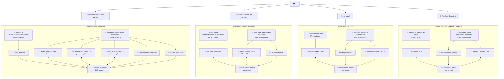

```mermaid
flowchart TD

    HOME["🏠 /"]

  

    %% CATEGORÍAS PRINCIPALES

    CAT1["📂 /automatizacion-con-excel/"]

    CAT2["📂 /automatizacion-de-procesos/"]

    CAT3["📂 /no-code/"]

    CAT4["📂 /analisis-de-datos/"]

  

    HOME --> CAT1

    HOME --> CAT2

    HOME --> CAT3

    HOME --> CAT4

  

    %% ── PILAR 1: EXCEL ──────────────────────────────────────

    subgraph P1["Automatización con Excel"]

        direction TB

  

        E_ENTRY1["🚪 Qué es la automatización con Excel\n(Principiante)"]

        E_ENTRY2["🚪 Guía para automatizar con Excel\n(Con experiencia)"]

  

        E_C1["⭐ Análisis de datos en Excel"]

        E_C2["⭐ Fórmulas en Excel: La guía completa"]

        E_C3["⭐ Gráficos en Excel: La guía completa"]

        E_C4["⭐ Herramientas en Excel"]

        E_C5["⭐ Macros en Excel"]

  

        E_CURSO["🎯 Curso de Excel"]

  

        E_POSTS["📄 Artículos de apoyo\n(~200 posts)"]

  

        E_ENTRY1 --> E_CURSO

        E_ENTRY2 --> E_C1

        E_ENTRY2 --> E_C2

        E_ENTRY2 --> E_C3

        E_ENTRY2 --> E_C4

        E_ENTRY2 --> E_C5

        E_CURSO --> E_POSTS

        E_C1 <--> E_POSTS

        E_C2 <--> E_POSTS

        E_C3 <--> E_POSTS

        E_C4 <--> E_POSTS

        E_C5 <--> E_POSTS

    end

  

    %% ── PILAR 2: AUTOMATIZACIÓN DE PROCESOS ─────────────────

    subgraph P2["Automatización de Procesos"]

        direction TB

  

        P_ENTRY1["🚪 Qué es la automatización de procesos\n(Principiante)"]

        P_ENTRY2["🚪 Guía para automatizar procesos\n(Con experiencia)"]

  

        P_C1["⭐ Mapeo y diseño de procesos"]

        P_C2["⭐ Herramientas: n8n / Make / Zapier"]

        P_C3["⭐ Power Automate"]

  

        P_POSTS["📄 Artículos de apoyo\n(por crear)"]

  

        P_ENTRY1 --> P_C1

        P_ENTRY2 --> P_C2

        P_ENTRY2 --> P_C3

        P_C1 <--> P_POSTS

        P_C2 <--> P_POSTS

        P_C3 <--> P_POSTS

    end

  

    %% ── PILAR 3: NO-CODE ─────────────────────────────────────

    subgraph P3["Plataformas No-code"]

        direction TB

  

        N_ENTRY1["🚪 Qué es el no-code\n(Principiante)"]

        N_ENTRY2["🚪 Guía para elegir tu herramienta\n(Con experiencia)"]

  

        N_C1["⭐ Google Sheets como herramienta"]

        N_C2["⭐ Airtable / Notion"]

        N_C3["⭐ Automatizaciones entre apps"]

  

        N_POSTS["📄 Artículos de apoyo\n(por crear)"]

  

        N_ENTRY1 --> N_C1

        N_ENTRY2 --> N_C2

        N_ENTRY2 --> N_C3

        N_C1 <--> N_POSTS

        N_C2 <--> N_POSTS

        N_C3 <--> N_POSTS

    end

  

    %% ── PILAR 4: ANÁLISIS DE DATOS ───────────────────────────

    subgraph P4["Análisis de Datos y Mejora Continua"]

        direction TB

  

        D_ENTRY1["🚪 Qué es el análisis de datos\n(Principiante)"]

        D_ENTRY2["🚪 Guía para tomar decisiones con datos\n(Con experiencia)"]

  

        D_C1["⭐ Dashboards e indicadores"]

        D_C2["⭐ Visualización efectiva"]

        D_C3["⭐ Mejora continua con datos"]

  

        D_POSTS["📄 Artículos de apoyo\n(por crear)"]

  

        D_ENTRY1 --> D_C1

        D_ENTRY2 --> D_C2

        D_ENTRY2 --> D_C3

        D_C1 <--> D_POSTS

        D_C2 <--> D_POSTS

        D_C3 <--> D_POSTS

    end

  

    CAT1 --> P1

    CAT2 --> P2

    CAT3 --> P3

    CAT4 --> P4
```