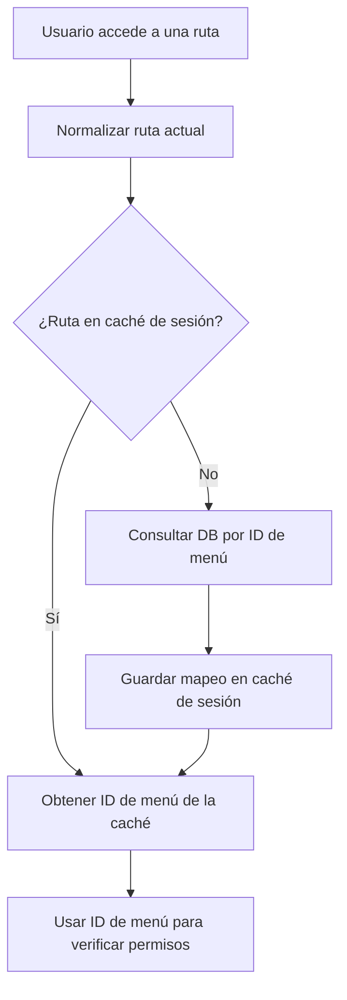

---
up:
  - "[[Crear versión SaaS de Bisstox Agricontrol]]"
related: 
created: 2025-05-15
---


## Fase 1: Cacheo del mapeo de rutas normalizadas a IDs de menú

### ¿Qué se implementó?

Se agregó una función al helper de permisos para cachear el mapeo entre la ruta normalizada (por ejemplo, `farms/index`) y el ID correspondiente en la tabla `sys_menu_items`.  
- La función primero busca en la sesión si ya existe el mapeo.
- Si no existe, consulta la base de datos, guarda el resultado en la sesión y lo retorna.
- Así, la consulta a la base de datos solo se realiza la primera vez por ruta en la sesión del usuario.

#### Ejemplo de función (pseudo-código):

```php
function get_menu_item_id_by_route($route) {
    $CI =& get_instance();
    $route_map = $CI->session->userdata('menu_route_map') ?: [];
    if (isset($route_map[$route])) {
        return $route_map[$route];
    }
    // Buscar en la base de datos
    $CI->db->select('id');
    $CI->db->from('sys_menu_items');
    $CI->db->where('url', $route);
    $CI->db->where('is_active', 1);
    $query = $CI->db->get();
    $row = $query->row();
    $menu_id = $row ? $row->id : null;
    // Guardar en caché de sesión
    $route_map[$route] = $menu_id;
    $CI->session->set_userdata('menu_route_map', $route_map);
    return $menu_id;
}
```

#### Diagrama


